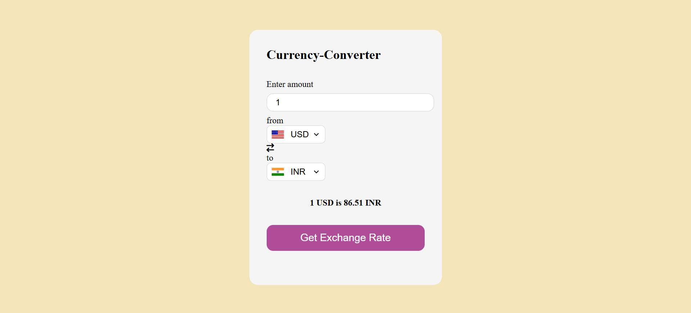

# 💱 Currency Converter

A simple and responsive Currency Converter web application built using HTML, CSS, and JavaScript. It allows users to convert any amount from one currency to another in real-time using exchange rate APIs.

---

## 🌟 Features

- Real-time currency exchange rates
- Easy-to-use interface
- Supports multiple international currencies
- Fully responsive design for mobile and desktop
- Instant conversion results

---

## 🧰 Technologies Used

- HTML5
- CSS3
- JavaScript (Vanilla JS)
- [ExchangeRate API](https://api.frankfurter.app/latest?amount=1&from=USD&to=INR) 

---

## 🚀 How to Use

1. Clone or download the repository:
   ```bash
   git clone https://github.com/mohdsohel-07/currency-converter.git
   ```

2. Open `index.html` in any web browser.

3. Select the currencies, enter the amount, and view the converted value instantly.

---

## 📁 Project Structure

```
currency-converter/
│
├── index.html       # HTML structure
├── style.css        # Styling and layout
├── script.js        # JavaScript logic & API
├── code.js          # All country codes & their currency codes
└── README.md        # Project information
```

---

## 📷 Screenshot

> *(Replace with actual screenshot after deployment)*  
> 

---

## 👨‍💻 Author

**Mohd Sohel**  
📧 Email: [zaiduroy@gmail.com](mailto:zaiduroy@gmail.com)  
🌐 GitHub: [mohdsohel-07](https://github.com/mohdsohel-07)

---


## ⭐ Support

If you like this project, consider giving it a ⭐ on [GitHub](https://github.com/mohdsohel-07) and sharing it with others!
